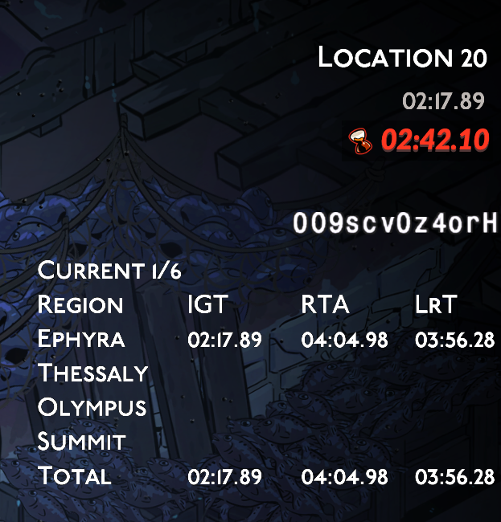
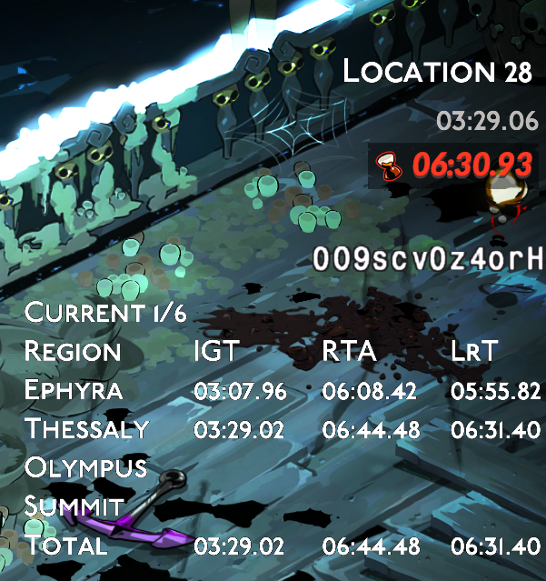
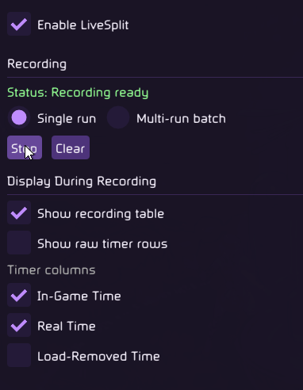
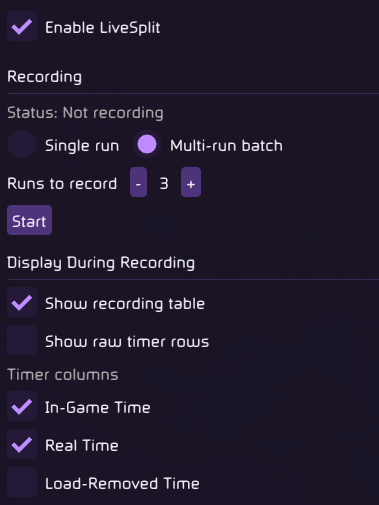

# LiveSplit

Mod to add LiveSplit like native support to the game.

Part of the [Speedrun modpack](https://thunderstore.io/c/hades-ii/p/adamantSpeedrun/Speedrun_Modpack/).

## What It Does

LiveSplit records runs and shows selected timing information while you play. Its main feature is a recording table that tracks your route through a run like a compact in-game LiveSplit layout.

## Examples

The recording table supports:

- Underworld routes: Erebus, Oceanus, Fields, and Tartarus.
- Surface routes: Ephyra, Thessaly, Olympus, and The Summit.
- Dream Dive routes, where the biome order is detected from the run.
- Single-run splits for a normal attempt.
- Multi-run batch recording for routing or practice sessions across several consecutive runs.

The timer can show these timing columns:

- IGT: in-game run time from the game's run timer.
- RTA: real elapsed time.
- LrT: load-removed time, with map-load time subtracted.

## Current Options

- Start, stop, and clear single-run or multi-run recording.
- Show or hide the recording table.
- Show optional raw IGT/RTA/LrT timer rows while recording is active.
- Choose which timer columns are visible.
- Use single-run split mode or multi-run batch recording.
- Record a batch of 1 to 10 runs and keep cumulative batch totals.

### Single-Run Recording

### Multi-Run Recording

## Gameplay Impact

This module only displays timing information. It does not change rooms, rewards, enemies, boons, or run generation.

## Installation

Install via r2modman.

This module is usually installed as part of the full [Speedrun modpack](https://thunderstore.io/c/hades-ii/p/adamantSpeedrun/Speedrun_Modpack/), where it appears in the shared Speedrun UI.
